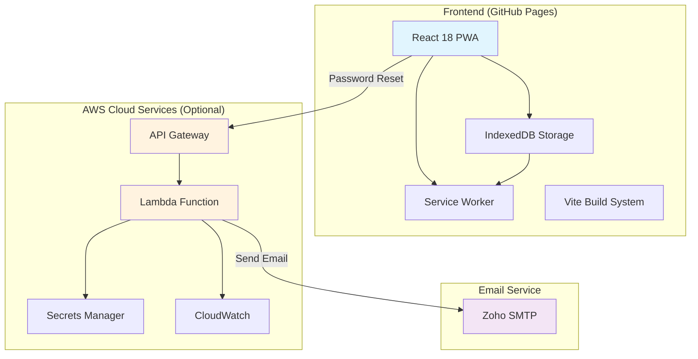
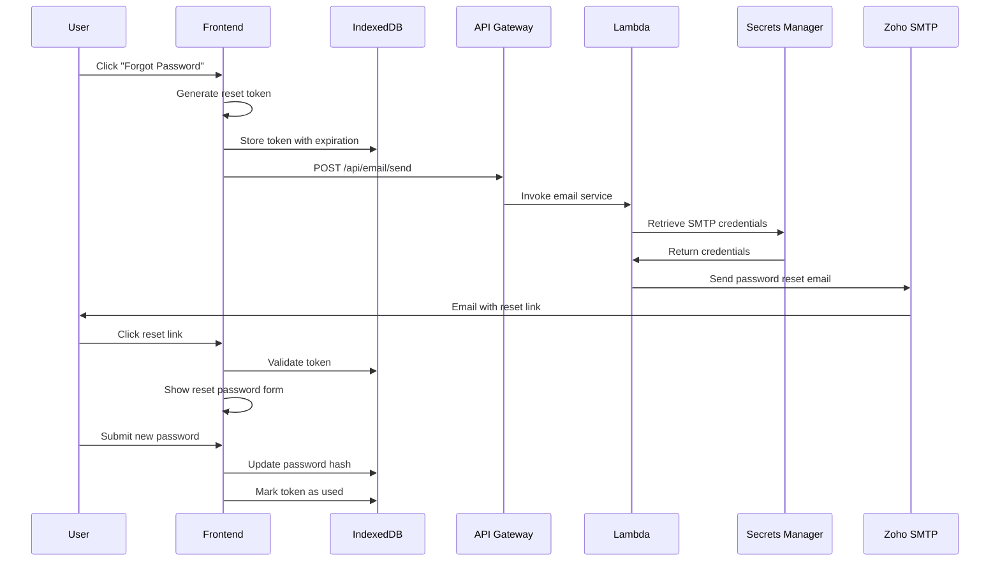

# Allowance Passbook

A modern Progressive Web Application (PWA) for managing family allowances with offline capabilities and optional cloud sync.

## Architecture Overview



## System Components

### Frontend Application
- **Framework**: React 18 with TypeScript
- **Build Tool**: Vite
- **State Management**: Zustand
- **Storage**: IndexedDB with Dexie
- **PWA**: Workbox for offline functionality
- **Hosting**: GitHub Pages with automatic deployment

### Backend Services (Optional)
- **API**: AWS API Gateway with CORS support
- **Compute**: AWS Lambda (Node.js 18.x runtime)
- **Secrets**: AWS Secrets Manager for SMTP credentials
- **Monitoring**: CloudWatch for logging and metrics

### Email System
- **Provider**: Zoho SMTP
- **Authentication**: Secure credential storage in AWS Secrets Manager
- **Templates**: HTML email templates with responsive design

## Password Reset Workflow



## Project Structure

```
passbook/
├── frontend/                  # React PWA application
│   ├── src/
│   │   ├── components/       # Reusable UI components
│   │   ├── pages/           # Page components
│   │   ├── services/        # Business logic services
│   │   └── types/          # TypeScript type definitions
│   ├── public/             # Static assets
│   └── .env.production     # Production environment config
├── aws/                     # AWS infrastructure
│   ├── cloudformation/     # Infrastructure as Code templates
│   ├── lambda/            # Lambda function code
│   └── scripts/          # Deployment and utility scripts
└── specs/                 # Project specifications
```

## Development Setup

### Prerequisites
- Node.js 20.x or later
- npm or yarn package manager

### Frontend Development
```bash
cd frontend
npm install
npm run dev
```

### Build for Production
```bash
cd frontend
npm run build
npm run preview
```

## Deployment

### Frontend Deployment
The frontend is automatically deployed to GitHub Pages via GitHub Actions when changes are pushed to the main branch.

### AWS Infrastructure Deployment
Deploy the optional cloud sync backend:

```bash
cd aws/scripts
./deploy.sh -e production -r us-west-2
```

### SMTP Configuration
Update the SMTP credentials in AWS Secrets Manager:

```bash
cd aws/scripts
./update-smtp-secret.sh production YOUR_SMTP_PASSWORD
```

## Features

### Core Functionality
- Parent and child account management
- Allowance tracking and history
- Transaction management
- Goal setting and tracking
- Report generation

### PWA Features
- Offline functionality
- App-like experience
- Push notifications (planned)
- Background sync (planned)

### Security Features
- Password reset via email
- Secure token management
- Data encryption at rest
- HTTPS enforcement

## Configuration

### Environment Variables

#### Frontend (.env.production)
```env
VITE_EMAIL_API_URL=https://your-api-gateway-url/api/email/send
```

#### Lambda Environment Variables
- `ENVIRONMENT`: Deployment environment (development/production)
- `AWS_REGION`: AWS region for services
- `ZOHO_SMTP_SECRET_NAME`: Name of SMTP secret in Secrets Manager

### AWS Secrets Manager
The SMTP credentials are stored as JSON in AWS Secrets Manager:

```json
{
  "password": "your-smtp-password",
  "host": "smtp.zoho.in",
  "port": "587",
  "secure": "false",
  "user": "your-smtp-username",
  "from": "your-from-email"
}
```

## Cost Optimization

The system is designed for minimal operational costs:

- **Frontend**: Free hosting on GitHub Pages
- **AWS Services**: Pay-per-use with generous free tiers
- **Email**: Zoho free tier sufficient for family use

Expected monthly costs:
- Small family (1-5 users): $0 (within free tiers)
- Medium family (5-20 users): $0-1
- Large extended family: $1-5

## Monitoring and Maintenance

### Health Checks
- Frontend builds automatically tested
- AWS Lambda function health monitored via CloudWatch
- Email delivery tracked through SMTP logs

### Updates
- Frontend updates deploy automatically via GitHub Actions
- AWS infrastructure updates via CloudFormation
- Dependencies updated through Dependabot

## Support and Troubleshooting

### Common Issues
1. **Password reset emails not received**: Check spam folder, verify SMTP credentials
2. **Offline functionality not working**: Ensure service worker is registered
3. **Data sync issues**: Check IndexedDB storage quota

### Logs and Debugging
- Frontend: Browser developer console
- Lambda: AWS CloudWatch Logs
- Email delivery: Check SMTP provider logs

## License

This project is licensed under the MIT License - see the LICENSE file for details.

## Contributing

1. Fork the repository
2. Create a feature branch
3. Make your changes
4. Test thoroughly
5. Submit a pull request

## Roadmap

- [ ] Mobile app versions (React Native)
- [ ] Advanced reporting and analytics
- [ ] Integration with banking APIs
- [ ] Multi-language support
- [ ] Advanced notification system