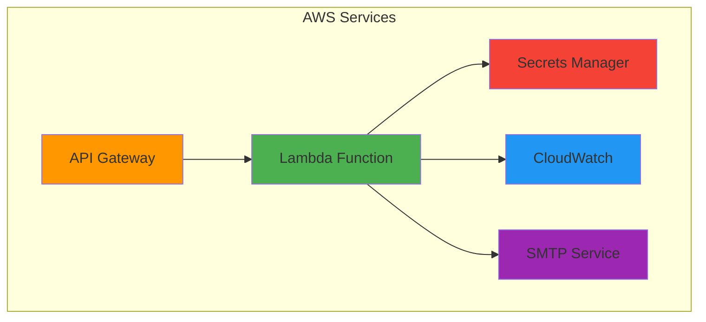

# AWS Infrastructure for Allowance Passbook

This directory contains AWS CloudFormation templates and deployment scripts for the optional cloud services backend.

## Architecture

The AWS backend provides email services for password reset functionality using a serverless, pay-per-use architecture.



## Services Used

- **API Gateway**: REST API endpoint with CORS support
- **Lambda**: Node.js 18.x runtime for email processing
- **Secrets Manager**: Secure SMTP credential storage
- **CloudWatch**: Logging and monitoring

## Directory Structure

```
aws/
├── cloudformation/
│   ├── templates/
│   │   └── main-template.yaml      # Complete infrastructure template
│   └── parameters/
│       ├── development.json        # Dev environment parameters
│       └── production.json         # Production environment parameters
├── lambda/
│   └── email-service/
│       ├── index.js               # Lambda function code
│       ├── package.json          # Dependencies
│       └── package-lambda.sh     # Build script
└── scripts/
    ├── deploy.sh                 # Deployment script
    ├── deploy-lambda.sh         # Lambda deployment
    ├── update-smtp-secret.sh    # SMTP credential management
    └── teardown.sh             # Safe teardown script
```

## Prerequisites

1. **AWS CLI** installed and configured
   ```bash
   aws configure
   ```

2. **AWS Permissions** for:
   - CloudFormation (full access)
   - Lambda (create/manage functions)
   - API Gateway (create/manage APIs)
   - Secrets Manager (create/manage secrets)
   - IAM (create roles/policies)
   - CloudWatch (create alarms)

## Deployment

### Initial Infrastructure Setup

```bash
cd aws/scripts
./deploy.sh -e production -r us-west-2
```

### SMTP Configuration

Update SMTP credentials in Secrets Manager:

```bash
./update-smtp-secret.sh production YOUR_SMTP_PASSWORD
```

### Lambda Function Deployment

Deploy or update the Lambda function code:

```bash
./deploy-lambda.sh production us-west-2
```

## Environment Configuration

### Development Environment
- Conservative limits (5K requests/day)
- Basic monitoring
- No data protection

### Production Environment
- Higher limits (50K requests/day)
- Full monitoring with dashboard
- Termination protection enabled

## SMTP Secret Format

The SMTP credentials are stored as JSON in AWS Secrets Manager:

```json
{
  "password": "your-smtp-password",
  "host": "smtp.zoho.in",
  "port": "587",
  "secure": "false",
  "user": "your-smtp-username@domain.com",
  "from": "your-from-email@domain.com"
}
```

## Cost Management

### Built-in Cost Controls
- API Gateway request limits per environment
- Lambda concurrent execution limits
- CloudWatch billing alarms at $1 and $5

### Expected Costs
- Small family (1-5 users): $0 (free tier)
- Medium family (5-20 users): $0-1/month
- Large family (20+ users): $1-5/month

## Monitoring

### CloudWatch Dashboards
Created automatically with metrics for:
- API Gateway (requests, latency, errors)
- Lambda (invocations, duration, errors)
- Cost tracking and billing alerts

### Key Metrics
- **API Gateway**: Request count, 4XX/5XX errors, latency
- **Lambda**: Invocations, errors, duration, throttles
- **Billing**: Estimated charges with alerts

## Troubleshooting

### Common Issues

1. **Email not sending**
   - Check CloudWatch logs for Lambda function
   - Verify SMTP credentials in Secrets Manager
   - Confirm API Gateway CORS configuration

2. **High costs**
   - Check CloudWatch billing dashboard
   - Review API Gateway usage patterns
   - Verify request limits are properly configured

3. **Deployment failures**
   - Validate CloudFormation template syntax
   - Check IAM permissions
   - Review parameter file format

### Debugging

```bash
# Check recent Lambda logs
aws logs describe-log-streams --log-group-name "/aws/lambda/allowance-passbook-production-email-service" --order-by LastEventTime --descending --limit 1

# Get specific log events
aws logs get-log-events --log-group-name "/aws/lambda/allowance-passbook-production-email-service" --log-stream-name "STREAM_NAME"

# Check current billing
aws cloudwatch get-metric-statistics \
  --namespace AWS/Billing \
  --metric-name EstimatedCharges \
  --start-time $(date -d '1 month ago' -u +%Y-%m-%dT%H:%M:%S) \
  --end-time $(date -u +%Y-%m-%dT%H:%M:%S) \
  --period 86400 \
  --statistics Maximum \
  --dimensions Name=Currency,Value=USD
```

## Security Features

- API keys for request authentication
- CORS restricted to specific origins
- Request validation at API Gateway
- Encrypted secrets storage
- IAM least-privilege access

## Teardown

To remove all AWS resources:

```bash
./teardown.sh -e production
```

**Warning**: This will delete all data and cannot be undone. Use with caution in production.

## Support

For AWS-specific issues:
1. Check CloudWatch logs for detailed error messages
2. Verify all services are deployed in the same region (us-west-2)
3. Ensure proper IAM permissions are configured
4. Review the CloudFormation stack events for deployment issues